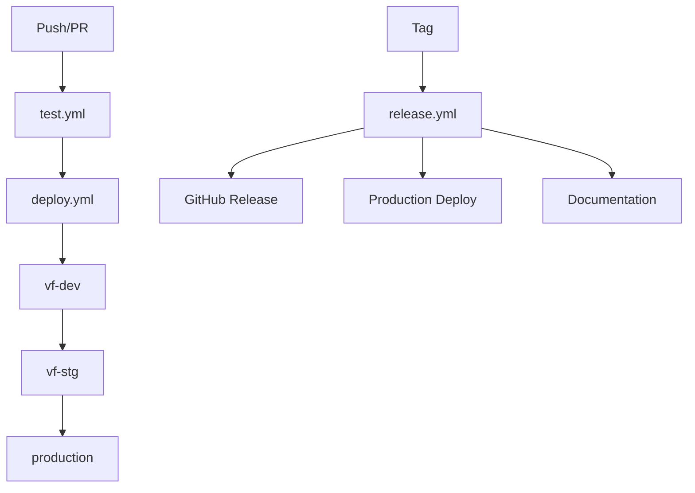

# GitHub Actions Workflows

This directory contains GitHub Actions workflows for the NA-Agents project, providing comprehensive CI/CD automation.

## Workflow Overview

### 🧪 [test.yml](test.yml) - Testing and Quality Assurance
**Triggers:** Push to main/develop, Pull requests, Daily schedule (2 AM UTC)

**Jobs:**
- **Unit Tests**: Runs tests on Node.js 18.x and 20.x with PostgreSQL and Redis services
- **Docker Build Test**: Validates Docker image builds correctly
- **Integration Tests**: End-to-end testing with all services running
- **Security Scans**: npm audit, Semgrep, and Trivy security scanning
- **Performance Tests**: Load testing with Artillery (scheduled/on-demand)
- **Code Quality**: ESLint, SonarCloud integration
- **Dependency Analysis**: Package auditing and bundle size tracking

**Key Features:**
- Matrix testing across Node.js versions
- Comprehensive security scanning with SARIF uploads
- Performance benchmarking
- Code coverage reporting to Codecov

### 🚀 [deploy.yml](deploy.yml) - Deployment Pipeline
**Triggers:** Push to main/develop, Pull requests, Manual workflow dispatch

**Environments:**
- **vf-dev**: Automatic deployment from develop/main branches
- **vf-stg**: Manual approval required, deployed from main branch
- **production**: Manual trigger only with comprehensive validation

**Jobs:**
1. **Quality Checks**: TypeScript compilation, linting, testing
2. **Security Scan**: Vulnerability scanning and container security
3. **Docker Build**: Multi-platform image build and ECR push
4. **Deploy Dev**: Automatic deployment to vf-dev with smoke tests
5. **Deploy Staging**: Manual approval with comprehensive testing
6. **Deploy Production**: Full production deployment with monitoring
7. **Cleanup**: ECR image cleanup (keep last 10 images)
8. **Notification**: Deployment status summary

**Key Features:**
- Multi-platform Docker builds (AMD64/ARM64)
- Progressive deployment with approval gates
- Automatic rollback capabilities
- Comprehensive health checks and smoke tests
- Resource cleanup automation

### 🎉 [release.yml](release.yml) - Release Management
**Triggers:** Git tags (v*.*.*), Manual workflow dispatch

**Jobs:**
1. **Create Release**: Version detection, changelog generation, GitHub release
2. **Build Release**: Tagged Docker image with stable tag
3. **Deploy Production**: Automatic production deployment for stable releases
4. **Update Docs**: Version bumping and documentation updates
5. **GitHub Pages**: API documentation generation and publishing
6. **Notification**: Release summary with deployment status

**Key Features:**
- Automatic changelog generation from commits
- Semantic versioning support
- Production deployment for stable releases only
- Documentation site generation
- Release artifact management

## Configuration Requirements

### Repository Secrets
These secrets must be configured in your GitHub repository:

```bash
# AWS Configuration
AWS_ACCESS_KEY_ID          # AWS access key for deployment
AWS_SECRET_ACCESS_KEY      # AWS secret key for deployment

# Optional Integrations
GITHUB_TOKEN              # Automatically provided by GitHub
CODECOV_TOKEN            # For code coverage reporting
SONAR_TOKEN              # For SonarCloud code analysis
```

### Repository Variables
These variables should be configured in your GitHub repository:

```bash
AWS_ACCOUNT_ID           # Your AWS account ID for ECR
```

### Environment Configuration
GitHub Environments should be configured with appropriate protection rules:

- **vf-dev**: No protection rules (automatic deployment)
- **vf-stg**: Require reviewers, deployment branch restrictions
- **production**: Require reviewers, deployment branch restrictions, wait timer

## Workflow Features

### Security Integration
- **SARIF Upload**: All security scan results are uploaded to GitHub Security tab
- **Dependency Scanning**: Automated vulnerability detection in dependencies
- **Container Security**: Docker image scanning with Trivy
- **Code Security**: Static analysis with Semgrep

### Quality Assurance
- **Multi-Node Testing**: Tests run on multiple Node.js versions
- **Service Integration**: Full integration testing with PostgreSQL and Redis
- **Performance Testing**: Load testing with Artillery
- **Code Coverage**: Detailed coverage reporting with Codecov integration

### Deployment Safety
- **Progressive Deployment**: Dev → Staging → Production flow
- **Health Checks**: Comprehensive endpoint testing
- **Smoke Tests**: Critical functionality validation
- **Rollback Capability**: Automatic failure detection and rollback

### Monitoring and Observability
- **Deployment Tracking**: Full deployment history and status
- **Performance Metrics**: Response time and throughput monitoring
- **Resource Utilization**: AWS resource usage tracking
- **Error Reporting**: Failed deployment notifications and logs

## Usage Examples

### Deploying to Staging
```bash
# Push to main branch triggers automatic vf-dev deployment
git push origin main

# Manual staging deployment
gh workflow run deploy.yml -f environment=vf-stg
```

### Creating a Release
```bash
# Tag-based release (recommended)
git tag v1.2.0
git push origin v1.2.0

# Manual release
gh workflow run release.yml -f version=v1.2.0 -f prerelease=false
```

### Running Tests
```bash
# Tests run automatically on push/PR
# Manual test run
gh workflow run test.yml
```

### Force Deployment
```bash
# Deploy even if tests fail (use with caution)
gh workflow run deploy.yml -f environment=vf-dev -f force_deploy=true
```

## Monitoring Workflow Status

### GitHub UI
- Visit `Actions` tab in your repository
- View workflow runs, logs, and artifacts
- Check deployment status in `Environments` section

### CLI Monitoring
```bash
# List recent workflow runs
gh run list

# View specific workflow run
gh run view <run-id>

# Watch workflow in real-time
gh run watch <run-id>
```

### Status Badges
Add these to your README for real-time status visibility:

```markdown


```

## Troubleshooting

### Common Issues

1. **AWS Credentials**: Ensure secrets are properly configured
2. **ECR Permissions**: Verify AWS user has ECR push/pull permissions
3. **Environment Variables**: Check repository variables are set
4. **Branch Protection**: Ensure workflow has permission to push to protected branches

### Debug Mode
Enable debug logging by setting repository secret:
```bash
ACTIONS_STEP_DEBUG=true
```

### Manual Intervention
All workflows support manual triggering with custom parameters for debugging and emergency deployments.

## Workflow Dependencies



This comprehensive CI/CD setup ensures reliable, secure, and monitored deployments with multiple quality gates and safety mechanisms.